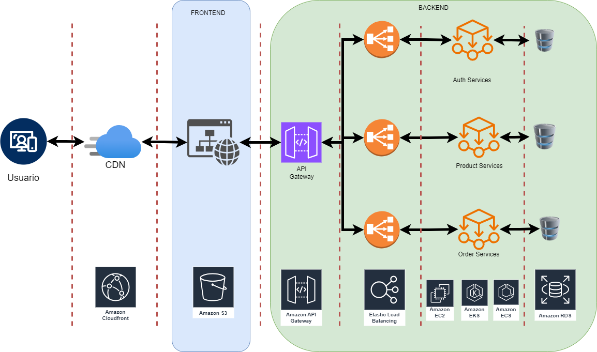
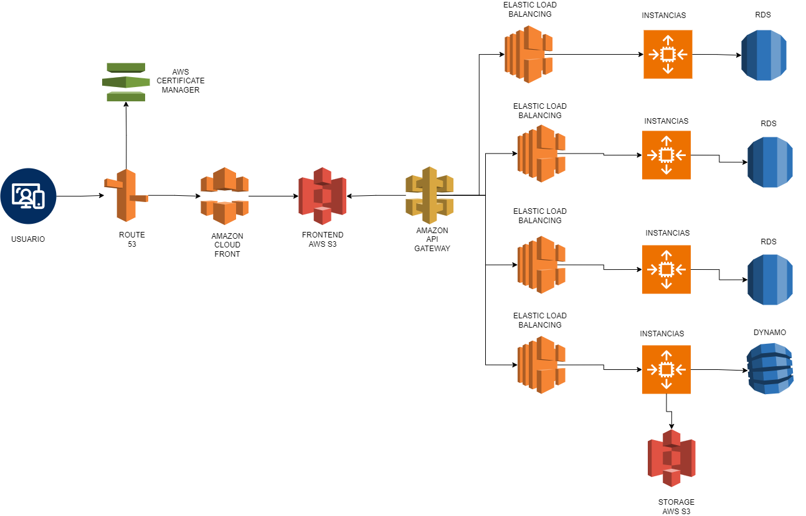

# Proyecto Prueba IKBO - Productos

# 1. App Planning (Architecture)

## Descripción

Este proyecto es una prueba técnica que implementa un sistema de gestionde productos perecederos utilizando una arquitectura de microservicios. La aplicación está diseñada para ser escalable y modular, permitiendo la integración de diferentes servicios como autenticación, gestión de productos e inventario.

Como se evidencia en el diagrama de arquitectura, es posible ejecutar cada servicio por independiente ya que cada microservicio posee la caracteristica de bajo acoplamiento.

Para efectos de la practica, solo se ha creado un repositorio. pero para un ambiente real, lo ideal seria que cada microservicio estuviera en un repositorio independiente, lo cual facilitaria su mantenibilidad y despliegue.

He seleccionado microservicios como arquitectura propuesta debido a que permite la alta disponibilidad y esta diseñada para plataforas robustas y con altos niveles de trafico. Adicionalmente su flexibilidad permite que la infraestructura de la aplicacion crezca a medida de la demanda y su escalabilidad sea lo mas transparente posible.

### Características

- **Microservicios**: Cada funcionalidad se encuentra en un servicio separado, lo que mejora la mantenibilidad y escalabilidad.
- **API Gateway**: Un punto de entrada único para todas las solicitudes, que se encarga de enrutar las peticiones a los servicios correspondientes.
- **Base de Datos**: Cada servicio puede tener su propia base de datos, lo que permite una mayor flexibilidad.

## Tecnologías Utilizadas

- **Nest.js**: Para el desarrollo del backend.
- **React.js**: Para el desarrollo del frontend.
- **TypeScript**: Para una mejor tipificación y desarrollo más robusto.
- **TypeORM**: Como ORM para abstraccion de la BBDD. y no depender de una tecnologia en concreto
- **Docker**: Para contenerización y despliegue.
- **PostgresSQL**: Base de datos para almacenamiento.

# 2. Cloud Design

Acontinuacion adjunto el diseño de la infraestructura en la nube, tomando como referencia el proveedor AWS.

Para la simulacion en local de la infraestructura, se genero un fichero docker-compose.yml por todo el proyecto, con el cual se levanta en local todos los contenedores necesarios para probar el aplicativo.

### Resultados esperados

Si todo ha ido bien en la url `http://localhost` estara disponible el frontend. Y desde alli se podran realizar las pruebas de los servicios basicos implementados.

- Registrar usuario
- Iniciar Sesion
- Crear Producto
- Listar productos
- Agregar/Descontar inventario
- Listar Inventario

