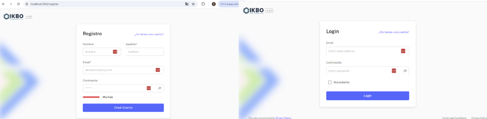
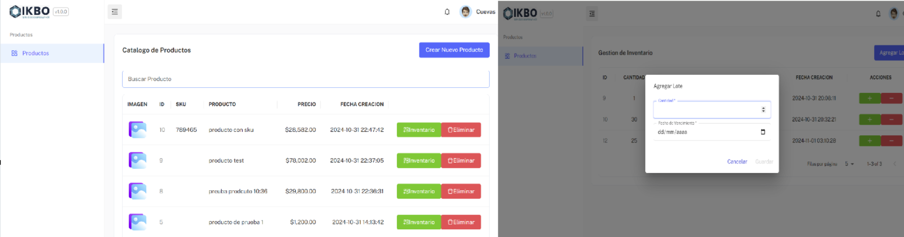

# Proyecto Prueba IKBO - Productos

## Instalación

1. Clona el repositorio:
   ```bash
   git clone https://github.com/andres233/productos-ikbo.git
    ```
2. Navega al directorio del proyecto

    ```
    cd productos-ikbo
    ```

3. Para ejecutar la aplicación, utiliza Docker

    ```
    docker compose up --build
    ```

4. Tendras en local toda la aplicacion ejecutandose


## Recomendaciones

en el fichero `docker-compose.yml` se encuentran las variables de entorno de cada servicio y dentro de ellas, los puertos que deben estar habilitados para que la ejecucion del proyecto sea exitosa. Acontinuacion adjunto los puertos que tendran que estar disponibles en caso que se ejecute tal cual estan los environments.

### Puertos disponibles

| Servicio            | Puerto                                          |
|--------------------|------------------------------------------------------|
| Frontend App | 80 |
| Backend Api Gateway | 3000  |
| Backend Auth Services | 50051 |
| Backend Product Services | 3001  |
| BBDD Postgres | 5433 |


### Resultados esperados

Si todo ha ido bien en la url `http://localhost` estara disponible el frontend. Y desde alli se podran realizar las pruebas de los servicios basicos implementados.

- Registrar usuario
- Iniciar Sesion
- Crear Producto
- Listar productos
- Agregar/Descontar inventario
- Listar Inventario



